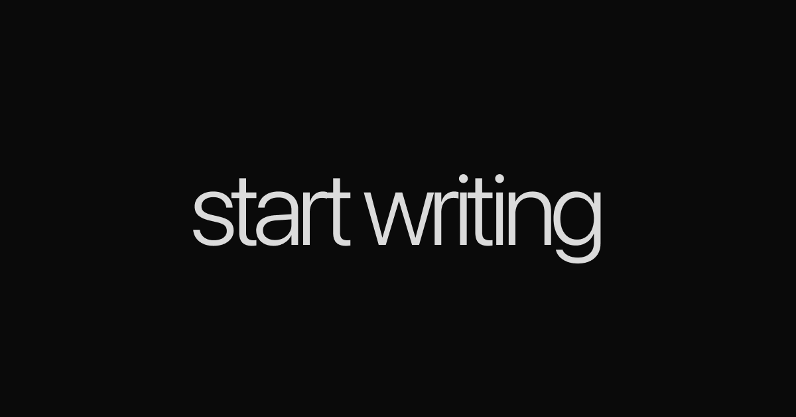
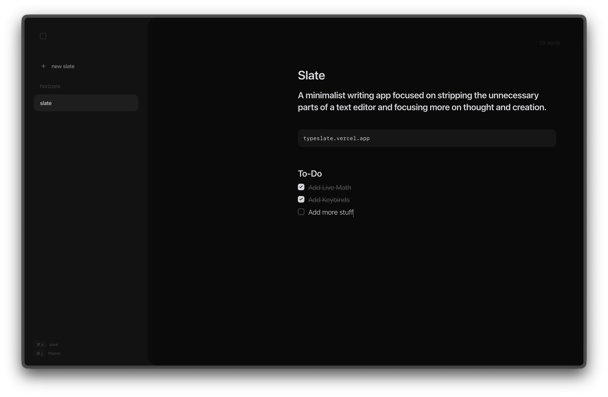
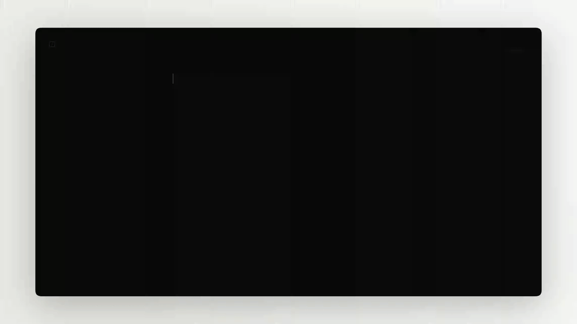
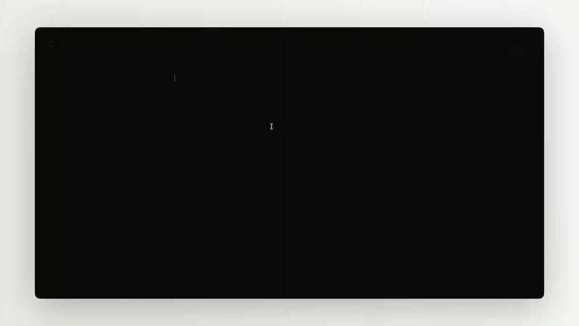

**Slate** is a minimalist writing app that focuses on stripping the unnecessary parts of a text editor and focuses more on thought and creation.

It's designed with a 'less is more' philosophy. Instead of a messy UI, it removes any and all visual clutter by reducing buttons, animations, and colors.

## Command Palette
Type '/' to access the markdown command palette and insert different styles such as headings, code snippets, lists, to-do's, etc.

## Live Math
Type a math expression into Slate and watch it calculate it and show the result. You can replace the expression with the result by pressing 'enter'.

## Keyboard Shortcuts

| Shortcut | Action |
|----------|--------|
| `Ctrl` / `⌘` + `J` | Toggle theme |
| `Ctrl` / `⌘` + `S` | Save (Markdown ↔ TXT) |

### AI Usage
- stupid editor bugs with formatting
- css
- debugging
- bug fixing

Made with ❤️ by Ary